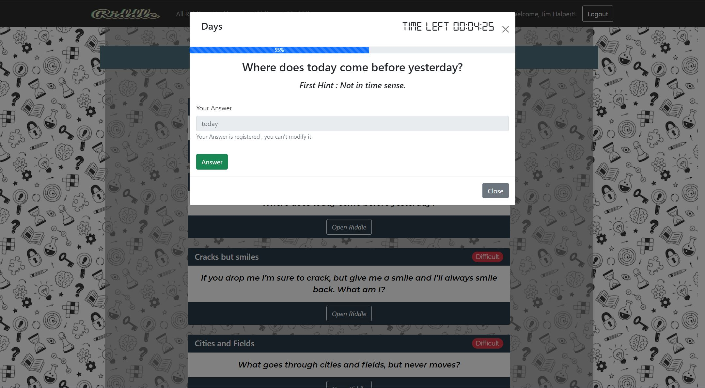

# Exam #2: "SolveMyRiddle"

## Student: s304816 SAYED AHMED Abdelrahman Ahmed Tawfik

## React Client Application Routes

**Navigation bar is common between all routes and views**

- Route `/`: Navigates to Route `/riddles`
- Route `/riddles`:  Main page with Nav and Cards to show available riddles divided into open and closed
- Route `riddles/:riddleId/answers` : Shows a table with answers given for the riddle with ID (riddleId)
- Route `login` : login page with Nav and login form
- Route `/new-riddle` : Form with all required fields to create a new riddle
- Route `/my-riddles` : Same view as home page , but made for logged-in user to visualize his created riddles
- Route `/ranking` : A table with current users having top 3 scores
- Route `*` : Default Route for wrong URLs , include a message and a button to go to home page

## API Server

### User Management

- POST `/api/sessions`
    - Description : Authenticate user trying to login
    - Request body :
  ```JSON
  {
  "username": "Pam@dundlerMifflin.com",
  "password": "PamyPamy"
  }
  ```
    - Response : `200 OK` (success)
    - Response body : Authenticated user
  ```JSON
  {
  "userId": "4",
  "email": "Pam@dundlerMifflin.com",
  "name": "Pam Beasly"
  }
  ```
    - Error Response : `500 Internal Server Error` (generic error), `401 Unauthorized User` (login failed)

  

- GET `'/api/sessions/current'`
    - Description : Check the current logged in user and return his data
    - Response : `200 OK` (success)
    - Response body : Authenticated user
  ```JSON
  {
  "userId": "4",
  "email": "Pam@dundlerMifflin.com",
  "name": "Pam Beasly"
  }
  ```
    - Error Response : `500 Internal Server Error` (generic error), `401 Unauthorized User` (User not authenticated)


- DELETE `'/api/sessions/current'`
    - Description : Logout the current user
    - Response : `200 OK` (success)
    - Response body : Empty Object
    - Error Response : `500 Internal Server Error` (generic error), `401 Unauthorized User` User not authenticated)

### Riddles Management

- GET `/api/riddles`
    - Description : Return all riddles available except those created by logged in user
    - Response : `200 OK` (success)
    - Response body : List of Riddles
  ```JSON
  [
    {"riddleId":1,
     "name":"Red City",
     "text":"It's a red city , with green walls and black small citizens ",
     "difficulty":"Easy",
     "state":"Closed",
     "duration":600,
     "hint1":"It's Round",
     "hint2":"It has a dangerous metal key",
     "authorId":1,
     "endDate":null,
     "solution":"watermelon"
    },
    {"riddleId":2,
     "name":"Three eyed",
     "text":"It has three eyes ,but  it can't see anything .",
     "difficulty":"Average",
     "state":"Closed",
     "duration":500,
     "hint1":"It has one leg",
     "hint2":"Tells you to move, wait or stop",
     "authorId":1,
     "endDate":null, 
     "solution":"stoplight"
     },
     "..."
  ]
  ```
    - Error Response : `500 Internal Server Error` (generic error)


- GET `/api/my-riddles`
    - Description : Return riddles created by logged in user
    - Response : `200 OK` (success)
    - Response body : List of Riddles
  ```JSON
  [
    {"riddleId":1,
     "name":"Red City",
     "text":"It's a red city , with green walls and black small citizens ",
     "difficulty":"Easy",
     "state":"Closed",
     "duration":600,
     "hint1":"It's Round",
     "hint2":"It has a dangerous metal key",
     "authorId":1,
     "endDate":null,
     "solution":"watermelon"
    },
    {"riddleId":2,
     "name":"Three eyed",
     "text":"It has three eyes ,but  it can't see anything .",
     "difficulty":"Average",
     "state":"Closed",
     "duration":500,
     "hint1":"It has one leg",
     "hint2":"Tells you to move, wait or stop",
     "authorId":1,
     "endDate":null, 
     "solution":"stoplight"
     },
     "..."
  ]
  ```
    - Error Response : `500 Internal Server Error` (generic error) ,  `401 Unauthorized User` (User not authenticated)


- GET `'/api/riddles/:riddleId'`
    - Description : Get riddle object and answer given by logged in user if exists
    - Request parameters : riddleId
    - Response : `200 OK` (success)
    - Response body : Riddle and user answer
  ``` JSON
  [
   {"riddleId":4,
     "name":"Head and tail",
     "text":"It has a head and a tail that will never meet.",
     "difficulty":"Difficult",
     "duration":600,
     "state":"Closed",
     "hint1":"Having too many of it is always a treat",
     "hint2":"It can flip",
     "solution":"coin",
     "authorId":2,
     "endDate":null
  },
   {"answer":"coin",
    "hasAnswered":true
   }]
  ```
    - Error Response : `500 Internal Server Error` (generic error), `401 Unauthorized User` (User not authenticated)
      , `404 Not Found` (No riddle with this Id) , `422 Unprocessable Entity` (ID not valid)


- POST `/api/new-riddle`
    - Description : Adding new riddle by logged in user
    - Request body :
  ``` JSON
   [
   {
     "name":"Head and tail",
     "text":"It has a head and a tail that will never meet.",
     "difficulty":"Difficult",
     "duration":600,
     "hint1":"Having too many of it is always a treat",
     "hint2":"It can flip",
     "solution":"coin",
  }
  ]
  ```
    - Response : `201 Created` (success)
    - Response body :
   ```
    [
      {"msg" : "Created Successfully"}
    ]
  ```
    - Error Response : `503 Internal Server Error` (Error Creating riddle in the database), `401 Unauthorized User` (
      User not authenticated) ,  `422 Unprocessable Entity` (Riddle Info is not valid)


- POST `/api/:riddleId/close`
    - Description : Close riddle after timeout
    - Request parameters : riddleId
    - Request body :
    - Response : `201 Created` (success)
    - Response body :
  ```JSON
      {"msg" : "Riddle Closed"}
  ```
    - Error Response : `503 Internal Server Error` (Error Creating riddle in the database), `401 Unauthorized User` (
      User not authenticated) ,  `422 Unprocessable Entity` (Riddle Info is not valid)

### Answers Management

- POST `/api/riddles/:riddleId`
    - Description : Adding answer by logged in user
    - Request parameters : riddleId
    - Response : `200 OK` (success)
    - Response body : Message indicating correctness of answer
  ```JOSN
   {ture}
  ```
    - Error Response : `503 Internal Server Error` Error Creating Answer in the database), `401 Unauthorized User` (User
      not authenticated) ,  `422 Unprocessable Entity` (Answer or riddleId not valid)


- GET `'/api/riddles/:riddleId/answers'`
    - Description : return all available answers for a riddle
    - Request parameters : riddleId
    - Response : `200 OK` (success)
    - Response body : list of answer objects
  ```JSON
  [
   {"answerId":7,
     "name":"Jim Halpert",
     "text":"car",
     "correct":0
   },
     {"answerId":16,
      "name":"Pam beasly",
      "text":"soap",
      "correct":1
      }
   ]
  ```
    - Error Response : `500 Internal Server Error` (generic error), `401 Unauthorized User` (User not authenticated)
      , `422 Unprocessable Entity` (ID not valid)

### Ranking Management

- GET `'/api/ranking'`
    - Description : Returns top 3 users (in parity return all with top 3 scores)
    - Response : `200 OK` (success)
    - Response body : list of users with scores
  ```JSON
  [
   {"userId":3,
    "name":"Jim Halpert",
   "score":12
   },
   {"userId":4,
    "name":"Pam beasly",
    "score":9
  },
   {"userId":5,
    "name":"Jan Levinson",
    "score":0
  }
  ]
  ```
    - Error Response : `500 Internal Server Error` (generic error)

## Database Tables

- Table `Users` - contains userId - name - email - salt - hash - score
- Table `Riddles` - contains riddleId - name -text - difficulty - duration - state - hint1 - hint2 - solution - authorId - endDate
- Table `Answers` - contains answerId - userId - riddleId - text - score - correct

## Main React Components

- `AddForm` (in `AddForm.js`): Gets user input and submit it to add a new riddle
- `AnswerForm` (in `AnswerForm.js`): Renders depending on set of states , if not disabled allows user to enter answer to
  submit answer for riddle
- `AnswerTable` (in `AnswerTable.js`): Show all answers for a specific riddle , providing the user who answered and its
  correctness
- `LoginForm` (in `Authentication.js`):Gets user credentials and allows login depending on credentials correctness
- `TopNav` (in `Nav.js`):Navbar with brand , links and a button for login or logout , layout depends if user is logged
  in or anonymous user
- `RiddleItem` (in `RiddleItem.js`): A card showing the main information about a specific riddle available for everyone
  , with a button to open modal and another to show answers for this riddle
- `RiddleModal` (in `RiddleModal.js`): A modal contaiang all relative data about the riddle , including a timer if
  needed , and answer form to allow answering that specific riddle
- `RankingTable` (in `RankingTable.js`): A table showing the users currently with top 3 scores

## Screenshot



## Users Credentials

| email                      | password                  | name          |
|----------------------------|---------------------------|---------------|
| Michael@dundlerMifflin.com | 1BestBoss                 | Michael Scott |
| Dwight@dundlerMifflin.com  | 2RegionalAssistantManager | Dwight Shrute |
| Jim@dundlerMifflin.com     | SMaRtPantSxx              | Jim Halpert   |
| Pam@dundlerMifflin.com     | PamyPamy                  | Pam beasly    |
| Jan@dundlerMifflin.com     | PassWord                  | Jan Levinson  |
